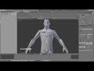
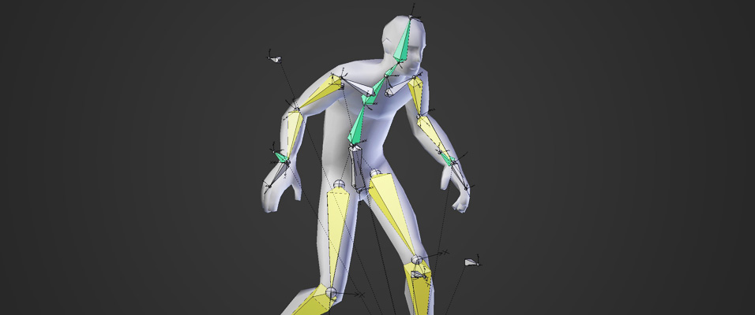
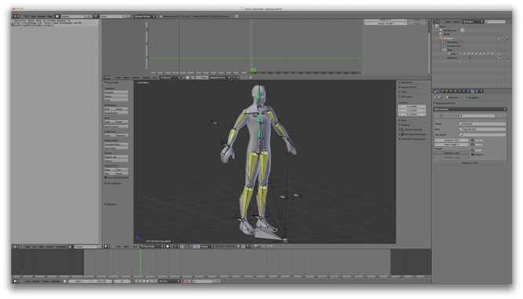
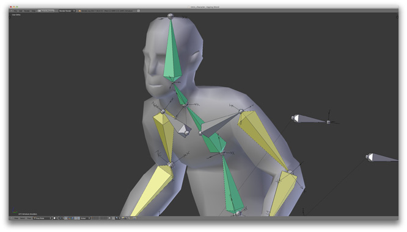
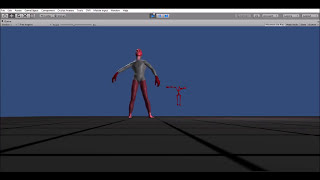

# Avatar Demo Project
The purpose of this demo was to create an avatar that would mimic the movements of the user and highlight the muscles that were being used in said movement by painting the zones of the body with a different color (red).

# Tutorial
Here is the Blender Tutorial that was used to create the 3D Avatar model with its own skeleton.

# Results
Here are some of the results

